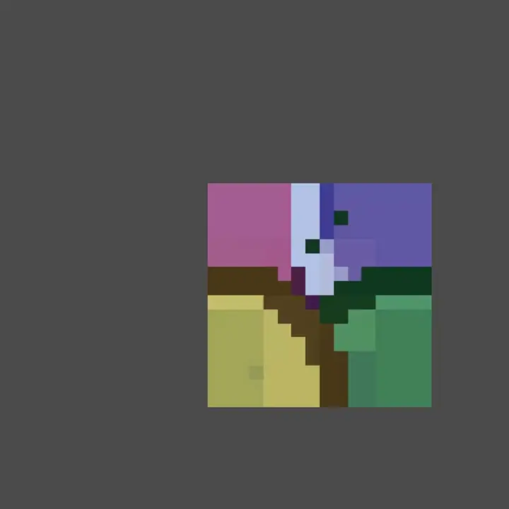
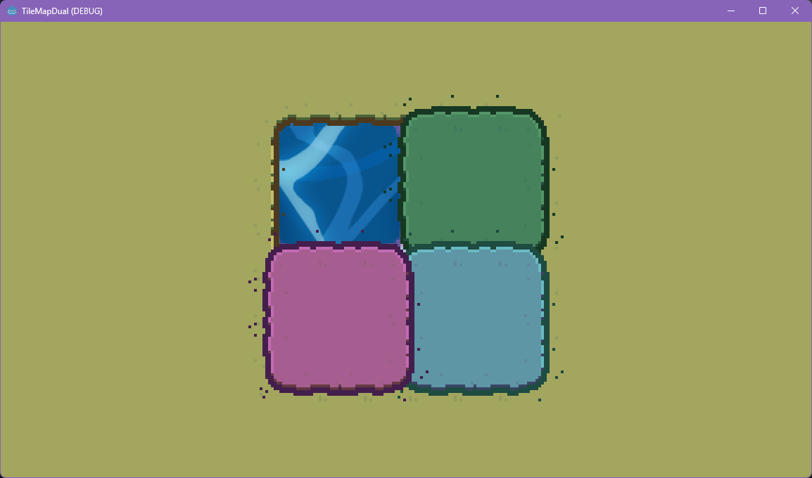

# TileMapDual

## Fork where i hack composite tiles in

theis is a quick hack to get composite tiles working such that atlas tiles with a transparrent background will be overlayed on top of eachother to give the illusion of one tile. as allways there are trade offs and gotyas but does give a super quick way to make one tilemaplayer have lots of diffrent terrains. 
there will be at most 4 layers to achive this effect (unless something goes verry wrong) and those will only be created if the tilemap needs it.

## IMPORTANT ANNOUNCEMENT

**We want YOU!** TileMapDual v5 is here with lots of updates, including hex grid support. Please report any issues you may encounter, and feel free to check the current issues, open new pull requests and contribute with your own code!
More info on the [v5 discussion](https://github.com/pablogila/TileMapDual/issues/16).

## Index

- [Introducing TileMapDual](#introducing-tilemapdual)
- [Installation](#installation)
- [Usage](#usage)
	- [Basic usage](#basic-usage)
	- [Isometric tiles](#isometric-tiles)
	- [Hex tiles and more](#hex-tiles-and-more)
	- [Multiple terrains](#multiple-terrains)
	- [Collisions](#collisions)
	- [TileMapDualLegacy stable version](#tilemapduallegacy-stable-version)
- [Contributing](#contributing)
- [FAQ and troubleshoot](#faq-and-troubleshoot)
- [License](#license)
- [References](#references)

## Introducing TileMapDual

Welcome to *TileMapDual*: a simple, automatic and straightforward custom `TileMapLayer` node for [Godot](https://github.com/godotengine/godot) that provides a real-time, in-editor and in-game dual-grid tileset system, for **all kinds of grids**. Square, isometric, hex... The only limit is your imagination!  

This dual-grid system, [as explained by Oskar Stålberg](https://x.com/OskSta/status/1448248658865049605), reduces the number of tiles required from 47 to just 15 (yes, fifteen!!), rocketing your dev journey!  

  

Not only that, but if your tiles are symmetrical, you can get away with drawing only 6 (six!) tiles and then generating the 15-tile-tilesets used by *TileMapDual*, thanks to tools like [Wang Tile Set Creator](https://github.com/kleingeist37/godot-wang-converter).  

  

All grids are supported by TileMapDual. Square, isometric, hex... The only limit is your imagination!  

  

Using a dual-grid system has the following advantages:  
- Only [15](https://user-images.githubusercontent.com/47016402/87044518-ee28fa80-c1f6-11ea-86f5-de53e86fcbb6.png) tiles are required for autotiling, instead of [47](https://user-images.githubusercontent.com/47016402/87044533-f5e89f00-c1f6-11ea-9178-67b2e357ee8a.png)
- The tiles can have perfectly rounded corners
- The tiles align to the world grid
- All grids are supported: square, hex, isometric...

## Installation

TileMapDual is installed as a regular Godot plugin.
Just copy the `addons/TileMapDual` folder to your Godot project, and enable it on *Project*, *Project settings...*, *Plugins*.  

## Usage

### Basic usage

TileMapDual is loaded in the same way as a regular `TileMapLayer` node.
You have to create a `TileMapDual` node with your own tileset, and set it up with the appropriate tile shape and orientation, etc.

You can now start sketching your level with the fully-filled tile, indicated below for a square grid.
You can also sketch with the empty tile in the bottom-left corner, or erase tiles as usual. The dual grid will update in real time as you draw! 

You can find several example scenes for all kinds of grids in the `examples/` folder.

### Isometric tiles

To use isometric tilemaps, all you need to do is follow an isometric-ed version of the [standard godot tileset](https://user-images.githubusercontent.com/47016402/87044518-ee28fa80-c1f6-11ea-86f5-de53e86fcbb6.png) template that we previously used for square tilemaps, as shown in the image below:  

  

This isometric tileset can be drawn by hand.
But it can also be drawn more easily using a tool like [TileCropper](https://github.com/pablogila/TileCropper), a Godot plugin that allows you to draw the tiles in one continuous image, to later separate the tiles as follows:  

  

### Hex tiles and more

Check the first video on [FAQ and Troubleshoot](#faq-and-troubleshoot) to see how to configure all kinds of grids.

### Multiple terrains

To use more than two terrain types, it is highly encouraged to use multiple TileMapDual layers:

### Collisions

To include extra data like collisions, pathing and such to your TileSet, it is recommended to use 2 separate spritesheets:
- one for displaying the tiles ("display tiles")
- one for program logic ("world tiles")

Here's how to set it up:

### Composite

only tested with basic square tilemaps.

**Tileset resorce needs &"Composite" bool metadata, that is set to true**

you need exsactly one fully transparrent tile that is marked as a terrain tile in the atlas 

### TileMapDualLegacy stable version

TileMapDual v5 was fully rewritten from the ground up. If you encounter issues, please report them on GitHub. For the time being, and to make the transition from v4 to v5 smoother, a custom `TileMapDualLegacy` node is available within the v5 version, containing the stable version from [v4.0.3](https://github.com/pablogila/TileMapDual/tree/v4.0.3).

Note that the legacy version only supports square and isometric grids. On the contrary, support for material shaders is fully implemented in the legacy version, and the performance is better than for the v5 version.

## Contributing

Please feel free to report issues and to open pull requests with your code contributions. You may want to check the [contributing guidelines](CONTRIBUTING.md) :D

More about how TileMapDual v5 works under the hood on the [v5 discussion issue](https://github.com/pablogila/TileMapDual/issues/16).

We thank all [code contributors](https://github.com/pablogila/TileMapDual/graphs/contributors), as well as all issue contributions and of course all users out there, including you, beautiful person reading this. TileMapDual wouldn't be the same without you!

This repo is currently managed by:

- [pablogila](https://github.com/pablogila) (first dev)
	- [Bluesky (@GilaPixel.bsky.social)](https://bsky.app/profile/gilapixel.bsky.social)
	- [YouTube (@GilaPixel)](https://www.youtube.com/@gilapixel)
	- [Instagram (@GilaPixel)](https://www.instagram.com/gilapixel/)
	- [Mastodon (@GilaPixel@mastodon.gamedev.place)](https://mastodon.gamedev.place/@GilaPixel)
	- [Twitter (@GilaPixel)](https://x.com/gilapixel)
	- [Reddit (/u/pgilah)](https://www.reddit.com/u/pgilah/)

- [raffimolero](https://github.com/raffimolero) (since v5)

## FAQ and troubleshoot

This plugin supports all the different tile shapes, layouts, and offset axes.
Here's a rundown of all of them, with common mistakes and their corresponding fix:

You can then put hitboxes on the display tiles and logic such as pathing on the logical tiles.
If your spritesheet doesn't follow the standard preset layout, you can manually set its terrains.
Here is how to set up a Hexagonal Vertical tileset:

You can safely switch to a different tileset if you need to:

You can use multiple atlases in the same TileSet, with a few quirks if you don't set up the terrains properly:

In case you make mistakes, you can edit the terrain configuration and see the results in real-time:

Some additional notes:
- Terrain autogeneration does not work if you are editing a TileSet by itself from the assets folder. You must put it in a TileMapDual first.
- It currently does not support alternative tiles.

## License

This project is Open Source Software, released under the [MIT license](LICENSE). This basically means that you can do whatever you want with it. Enjoy! 

## References

- [Dual grid Twitter post by Oskar Stålberg](https://x.com/OskSta/status/1448248658865049605)
- ['Programming Terrain Generation' video by ThinMatrix](https://www.youtube.com/watch?v=buKQjkad2I0)
- ['Drawing Fewer Tiles' video by jess::codes](https://www.youtube.com/watch?v=jEWFSv3ivTg)
- [jess::codes implementation in C#](https://github.com/jess-hammer/dual-grid-tilemap-system-godot)
- [GlitchedInOrbit implementation in GDScript](https://github.com/GlitchedinOrbit/dual-grid-tilemap-system-godot-gdscript)
- [Wang Tile Set Creator](https://github.com/kleingeist37/godot-wang-converter)
- [Webtyler tool, to convert from 15-tile sets to 47-tile sets](https://wareya.github.io/webtyler/)
- Sources for [snowflake svg](https://pixsector.com/icon/free-snowflake-svg-vectorart/967) and [water svg](https://www.svgrepo.com/svg/103674/water-drop)
